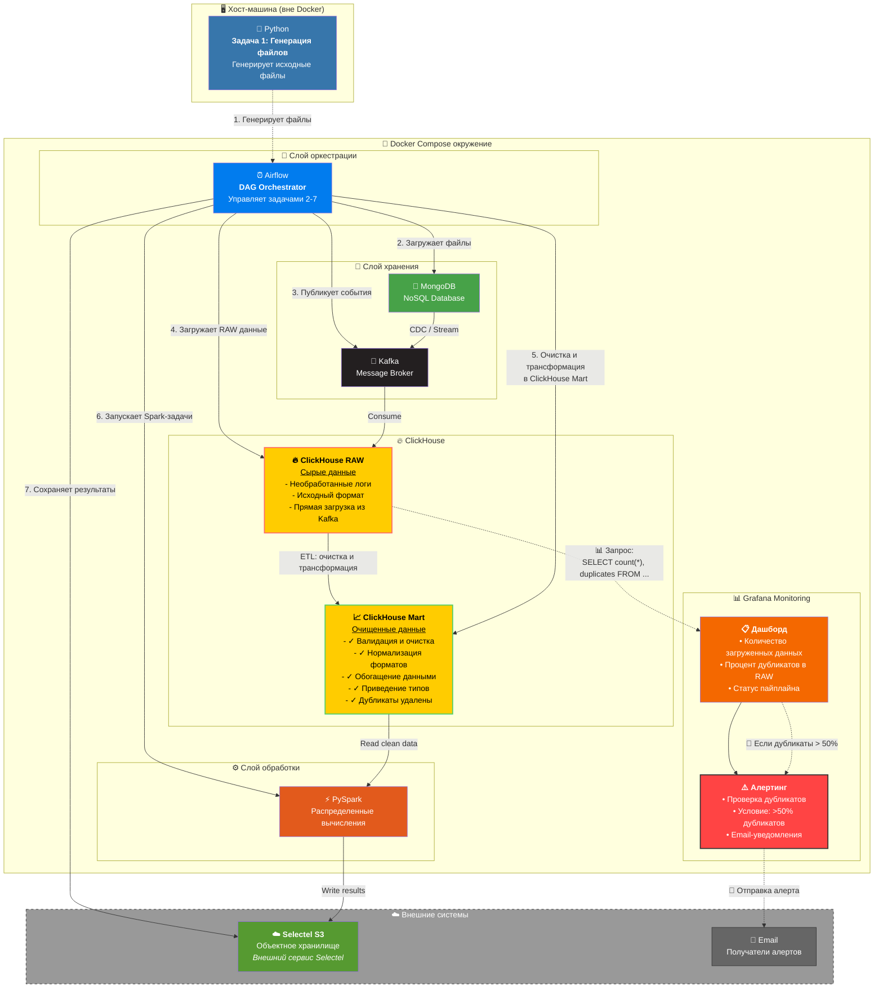

[](https://www.python.org/downloads/)
[](https://airflow.apache.org/)
[](https://spark.apache.org/)
[](https://clickhouse.com/)
[](https://kafka.apache.org/)
[](https://www.mongodb.com/)
[](https://grafana.com/)
[](https://www.docker.com/)
[](LICENSE)
# Проект аналитической системы для сети розничных магазинов "Пикча"
## Описание задания

Необходимо сделать аналитическую систему для сетевого магазина **"Пикча"**, которая позволит им выгоднее</br> 
и эффективнее продавать товары.

### <ins>I Создание RAW слоя в ClickHouse</ins>

В качестве исходных данных мы имеем контур заказчика **NoSQL**, куда хаотично льются</br> 
данные со стороны всех магазинов.</br> 

Обозначим следующие магазины:
1. Большая Пикча (помещение более 200 кв.м.). Количество магазинов по стране - 30. Некоторые в одном городе.
2. Маленькая Пикча (помещение менее 100 кв.м.). Количество магазинов по стране - 15. Некоторые в одном городе.

Заказчик НЕ СОГЛАСЕН выдать доступ к **NoSQL** хранилищу.</br>  
Предварительно он хочет увидеть демо-версию рабочего инструмента и лишь потом готов выдать доступ к контуру **NoSQL**

Внутри каждого магазина существует товары пяти основных продовольственных групп, а именно:
| №| Описание                            |
|--|-------------------------------------|
|1.| 🥖 Зерновые и хлебобулочные изделия|
|2.| 🥩 Мясо, рыба, яйца и бобовые|
|3.| 🥛 Молочные продукты|
|4.| 🍏 Фрукты и ягоды|
|5.| 🥦 Овощи и зелень|

В каждую из групп входит не менее 20 позиций (итого 100 товаров в ассортименте).</br>  
Так, например в овощи и зелень входят - шпинат, капуста, лук, чеснок и прочее.</br> 

У каждого товара есть свой набор атрибутов, так например выглядит схема какого-то творога.</br> 
```
{
  "id": "prd-0037",
  "name": "Творог 5%",
  "group": "Молочные",
  "description": "Творог из коровьего молока, 5% жирности",
  "kbju": {
    "calories": 121,
    "protein": 16.5,
    "fat": 5,
    "carbohydrates": 3.3
  },
  "price": 89.99,
  "unit": "упаковка",
  "origin_country": "Россия",
  "expiry_days": 12,
  "is_organic": false,
  "barcode": "4600111222333",
  "manufacturer": {
    "name": "ООО Молочный Комбинат",
    "country": "Россия",
    "website": "https://moloko.ru",
    "inn": "7723456789"
  }
}
```
Портрет покупателя в магазине Пикча не представляется возможным без бонусной карты.</br>  
То есть если покупатель пришел, купил что-то и ушел - то для магазина он никто в плане цифрового портрета.</br>
Схема покупателя выглядит следующим образом: </br> 
```
{
  "customer_id": "cus-102345",
  "first_name": "Алексей",
  "last_name": "Иванов",
  "email": "alexey.ivanov@example.com",
  "phone": "+7-900-123-45-67",
  "birth_date": "1990-04-15",
  "gender": "male",
  "registration_date": "2023-08-20T14:32:00Z",
  "is_loyalty_member": true,
  "loyalty_card_number": "LOYAL-987654321",
  "purchase_location": {
    "store_id": "store-001",
    "store_name": "Большая Пикча — Магазин на Тверской",
    "store_network": "Большая Пикча",
    "store_type_description": "Супермаркет площадью более 200 кв.м. Входит в федеральную сеть из 30 магазинов.",
    "country": "Россия",
    "city": "Москва",
    "street": "ул. Тверская",
    "house": "15",
    "postal_code": "125009"
  },
  "delivery_address": {
    "country": "Россия",
    "city": "Москва",
    "street": "ул. Ленина",
    "house": "12",
    "apartment": "45",
    "postal_code": "101000"
  },
  "preferences": {
    "preferred_language": "ru",
    "preferred_payment_method": "card",
    "receive_promotions": true
  }
}
```
Очевидно, что у каждого магазина существует свой набор атрибутов:</br> 
```
{
  "store_id": "store-001",
  "store_name": "Большая Пикча — Магазин на Тверской",
  "store_network": "Большая Пикча",
  "store_type_description": "Супермаркет площадью более 200 кв.м. Входит в федеральную сеть из 30 магазинов, некоторые из которых находятся в одном городе.",
  "type": "offline",
  "categories": [
    "🥖 Зерновые и хлебобулочные изделия",
    "🥩 Мясо, рыба, яйца и бобовые",
    "🥛 Молочные продукты",
    "🍏 Фрукты и ягоды",
    "🥦 Овощи и зелень"
  ],
  "manager": {
    "name": "Светлана Петрова",
    "phone": "+7-900-555-33-22",
    "email": "manager@tverskoy-store.ru"
  },
  "location": {
    "country": "Россия",
    "city": "Москва",
    "street": "ул. Тверская",
    "house": "15",
    "postal_code": "125009",
    "coordinates": {
      "latitude": 55.7575,
      "longitude": 37.6156
    }
  },
  "opening_hours": {
    "mon_fri": "09:00-21:00",
    "sat": "10:00-20:00",
    "sun": "10:00-18:00"
  },
  "accepts_online_orders": true,
  "delivery_available": true,
  "warehouse_connected": true,
  "last_inventory_date": "2025-06-28"
}
```
И, конечно же, нам нужны покупки, которые купил покупатель в определенном магазине.</br> 
```
{
  "purchase_id": "ord-20250710-001",
  "customer": {
    "customer_id": "cus-102345",
    "first_name": "Алексей",
    "last_name": "Иванов",
    "email": "alexey.ivanov@example.com",
    "phone": "+7-900-123-45-67",
    "is_loyalty_member": true,
    "loyalty_card_number": "LOYAL-987654321"
  },
  "store": {
    "store_id": "store-001",
    "store_name": "Большая Пикча — Магазин на Тверской",
    "store_network": "Большая Пикча",
    "store_type_description": "Супермаркет площадью более 200 кв.м. Входит в федеральную сеть из 30 магазинов.",
    "location": {
      "city": "Москва",
      "street": "ул. Тверская",
      "house": "15",
      "postal_code": "125009"
    }
  },
  "items": [
    {
      "product_id": "prd-0037",
      "name": "Творог 5%",
      "category": "🥛 Молочные продукты",
      "quantity": 2,
      "unit": "упаковка",
      "price_per_unit": 89.99,
      "total_price": 179.98,
      "kbju": {
        "calories": 121,
        "protein": 16.5,
        "fat": 5,
        "carbohydrates": 3.3
      },
      "manufacturer": {
        "name": "ООО Молочный Комбинат",
        "country": "Россия",
        "website": "https://moloko.ru",
        "inn": "7723456789"
      }
    },
    {
      "product_id": "prd-0012",
      "name": "Хлеб ржаной",
      "category": "🥖 Зерновые и хлебобулочные изделия",
      "quantity": 1,
      "unit": "булка",
      "price_per_unit": 45.00,
      "total_price": 45.00
    }
  ],
  "total_amount": 224.98,
  "payment_method": "card",
  "is_delivery": true,
  "delivery_address": {
    "city": "Москва",
    "street": "ул. Ленина",
    "house": "12",
    "apartment": "45",
    "postal_code": "101000"
  },
  "purchase_datetime": "2025-07-10T17:45:00Z"
}
```
Таким образом мы получаем структуру - магазин, клиент, товары, покупки.</br>
И, увы, все это лежит вместе в NoSQL хранилище. Поэтому на текущий момент необходимо </br> 
разработать схемы хранения данных и выбрать для этого какое-то хранилище + выбрать корректные типы данных. 
Требуется наличие :
1. 45 JSON файлов, описывающих каждый магазин. Структура - Выше.
2. Необходимо создать не менее `20 JSON` файлов, которые будут описывать товары - структура выше.
3. Необходимо создать минимум `1 покупателя` в каждом магазине. Структура - Выше.
4. Не менее `200 покупок` от различных покупателей в разных магазинах. Структура выше.
5. После того, как пункты выше будут выполнены необходимо реализовать следующую задачу: 
    - Добавить все **JSON** файлы в **NoSQL** хранилище (**Docker**). Реализовать это необходимо при помощи скрипта на **Python**, который заберет из локальной директории все **JSON** файлы для загрузки. Таким образом мы смоделируем хранилище заказчика.
    - Далее необходимо при помощи **Kafka** загрузить эти данные в **RAW** (сырое) хранилище. Необходимо взять **ClickHouse**. Важно, чтобы каждая таблица отвечала за что-то свое и могла джойнится с другой. Так, например, очевидно, что покупатели будут связаны с магазинами, покупками и товарами. Важно, что в **Clickhouse** данные прилетают в том виде в котором они лежали у заказчика, так как это **RAW** хранилище.
    - А это значит, что номера будут загружены, как **STRING**.
    - Параметры **Kafka** - забрать только то, что лежит в хранилище.</br> 

Таким образом в ходе выполнения этой части задания мы получим данные от заказчика в своей системе. </br> 
Но, необходимо внимательно отнестить к персональной информации. </br>
```
Персональная информация (телефон и почта) должны быть зашифрованы любым удобным способом до загрузки их в Clickhouse. 
Более того необходимо предусмотреть приведение только этих двух полей к нормальному единому виду.
```
Таким образом, мы получим загрузку данных из хранилища заказчика в наше хранилище посредством использования `Kafka/Python/Clickhouse/NoSQL`. </br> 
Ну и конечно же, чтобы было удобней проверить данное задание, необходимо выполнить следующий пункт.</br> 
    - Построить дашборд в графане на основе которого можно будет сделать вывод о том, что количество покупок действительно 200 или больше, а магазинов 45.

<ins>Критерии проверки следующие:</ins>
1. Есть **GIT** репозиторий в котором описываются участники команды.
2. Есть генератор файлов **JSON**, есть загрузчик этих файлов **JSON** в **NoSQL**.
3. Есть **docker** compose с `kafka, clickhouse, NoSQL, grafana`.
4. Есть дашборд в **Grafana** (нужен скриншот).

### <ins>II Clickhouse RAW | Clickhouse MART</ins>
После того, как выполнена первая часть задания и заказчик удостоверяется в том, что у нас действительно есть ресурсы для сохранения его данных , они лежат в нормальном виде и визуализируются, нам необходимо разработать внутренний `ETL пайплайн`, который будет предусматривать: 

1. Взятие данных из **Clickhouse**, **SQL** будет очищать их и переносить в другую БД **Clickhouse**. 
2. Скрипт должен быть написан полностью на SQL и должен включаться в момент вставки данных в сырые таблицы. 
3. В него дефолтно будут входить:
    - проверка дубликатов
    - проверка пустых строк
    - проверка NULL
    - проверка адекватности значений - то есть дата покупки, дата рождения - не должны быть позже текущего дня.
    - все данные должны быть приведены в нижний регистр

4. В случае превышения > 50 % дубликатов в исходных таблицах - алертить в телеграмм или на почту при помощи **Grafana**.

<ins>Критерии проверки следующие:</ins> 
1. В гите указан телеграмм бот (название, скриншот его работы)
2. Приложен **SQL** скрипт, который выполняет очистку данных и делает это при помощи **MV**.
3. В **Grafana** реализован алертинг дубликатов. (скриншот)

Таким образом здесь мы научимся очищать первородные данные и готовить их к дальнейшей обработке.

### III Clickhouse MART | Традиционный ETL
Как только данные преобразованы в адекватный вид - самое время начать решать бизнес задачи заказчика.</br> 
А условие будет следующее:</br> 
1. Необходимо построить `ETL процесс` на **PySpark** (локально). 
2. Данные для построения витрины необходимо забирать из `Clickhouse MART` (который у нас в **Docker**)
3. В ходе создания витрины будут созданы несколько полей, а именно матрица признаков, которая позволит
   выявлять покупательские группы (кластеризация): 

| №| Признак            | Описание                                    |
|--|--------------------|---------------------------------------------|
|1|	bought_milk_last_30d|	Покупал молочные продукты за последние 30 дней|
|2|	bought_fruits_last_14d|	Покупал фрукты и ягоды за последние 14 дней|
|3|	not_bought_veggies_14d|	Не покупал овощи и зелень за последние 14 дней|
|4|	recurrent_buyer|	Делал более 2 покупок за последние 30 дней|
|5|	inactive_14_30|	Не покупал 14–30 дней (ушедший клиент?)|
|6|	new_customer|	Покупатель зарегистрировался менее 30 дней назад|
|7|	delivery_user|	Пользовался доставкой хотя бы раз|
|8|	organic_preference|	Купил хотя бы 1 органический продукт|
|9|	bulk_buyer|	Средняя корзина > 1000₽|
|10|	low_cost_buyer|	Средняя корзина < 200₽|
|11|	buys_bakery|	Покупал хлеб/выпечку хотя бы раз|
|12|	loyal_customer|	Лояльный клиент (карта и ≥3 покупки)|
|13|	multicity_buyer|	Делал покупки в разных городах|
|14|	bought_meat_last_week|	Покупал мясо/рыбу/яйца за последнюю неделю|
|15|	night_shopper|	Делал покупки после 20:00|
|16|	morning_shopper|	Делал покупки до 10:00|
|17|	prefers_cash|	Оплачивал наличными ≥ 70% покупок|
|18|	prefers_card|	Оплачивал картой ≥ 70% покупок|
|19|	weekend_shopper|	Делал ≥ 60% покупок в выходные|
|20|	weekday_shopper|	Делал ≥ 60% покупок в будни|
|21|	single_item_buyer|	≥50% покупок — 1 товар в корзине|
|22|	varied_shopper|	Покупал ≥4 разных категорий продуктов|
|23|	store_loyal|	Ходит только в один магазин|
|24|	switching_store|	Ходит в разные магазины|
|25|	family_shopper|	Среднее кол-во позиций в корзине ≥4|
|26|	early_bird|	Покупка в промежутке между 12 и 15 часами дня|
|27|	no_purchases|	Не совершал ни одной покупки (только регистрация)|
|28|	recent_high_spender|	Купил на сумму >2000₽ за последние 7 дней|
|29|	fruit_lover|	≥3 покупок фруктов за 30 дней|
|30|	vegetarian_profile|	Не купил ни одного мясного продукта за 90 дней|

Наша задача собрать и отдать заказчику готовую информацию. </br>
А его аналитики уже сделают какие-то выводы из этого. </br> 
Пример строки в итоговой таблице (такой формат дан для удобства чтения). </br> 
0 или 1 заменяемы на True/False - на Ваше усмотрение: 
```
{
  "customer_id": "cus-102345",
  "bought_milk_last_30d": 1,
  "bought_fruits_last_14d": 1,
  "not_bought_veggies_14d": 0,
  "recurrent_buyer": 1,
  "inactive_14_30": 0,
  "new_customer": 0,
  "delivery_user": 1,
  "organic_preference": 1,
  "bulk_buyer": 0,
  "low_cost_buyer": 1,
  "buys_bakery": 1,
  "loyal_customer": 1,
  "multicity_buyer": 0,
  "bought_meat_last_week": 0,
  "night_shopper": 1,
  "morning_shopper": 0,
  "prefers_cash": 0,
  "prefers_card": 1,
  "weekend_shopper": 1,
  "weekday_shopper": 0,
  "single_item_buyer": 0,
  "varied_shopper": 1,
  "store_loyal": 1,
  "switching_store": 0,
  "family_shopper": 1,
  "early_bird": 0,
  "no_purchases": 0,
  "recent_high_spender": 1,
  "fruit_lover": 1,
  "vegetarian_profile": 1
}
```
                  
Задание со звездочкой предусматривает создание обертки для этого процесса в **Airflow**. 
Расписание 10:00. Данные всегда берем все!</br> 
То есть если в данных заказчика были внесены изменения - мы всегда будем получать актуальную информацию!</br> 
И, наконец, данные необходимо куда-то отправить - пусть это будет **S3** (можно использовать **Minio** в **Docker**), </br>
где будет лежать файл **CSV** в формате `analytic_result_2025_08_01`. </br> 
Количество столбцов = количество полей указанных в ТЗ.</br> 

<ins>Критерии проверки следующие:</ins>
1. Есть `ETL процесс` на **PySpark**. Реализована логика хотя бы 10 полей из 30. (полный код в **GIT**)
2. Файл формируется и загружается в **S3** (**MINIO**, **Selectel**).

## Реализация проекта
**DE Retail Analytics** — это полноценная платформа для сбора, обработки и анализа данных розничной торговой сети. Система предназначена для управления данными магазинов двух форматов: гипермаркетов **«Большая Пикча»** и магазинов у дома **«Маленькая Пикча»**. 
## 🏗 Архитектура системы

### Диаграмма архитектуры проекта

### 🛠 Технологический стек

| Категория | Технология | Версия | Назначение |
|-----------|------------|--------|------------|
| **Оркестрация** | Apache Airflow | 2.9.2 | Управление DAG, планирование задач |
| **Базы данных** | MongoDB | 6.0 | Документоориентированное хранилище |
| | ClickHouse | Latest | Колоночное аналитическое хранилище |
| | PostgreSQL | 13 | Metadatabase для Airflow |
| **Стриминг** | Apache Kafka | 7.3.3 | Брокер сообщений |
| | Zookeeper | 7.3.3 | Координация Kafka |
| **Обработка** | Apache Spark | 3.4.2 | Распределённая обработка данных |
| | PySpark | 3.4.2+ | Python API для Spark |
| **Хранилище** | S3 Selectel | - | Объектное хранилище |
| **Визуализация** | Grafana | Latest | Дашборды и мониторинг |
| | Kafka UI | Latest | Мониторинг топиков Kafka |
| **Контейнеризация** | Docker | Latest | Контейнеризация сервисов |
| | Docker Compose | Latest | Оркестрация контейнеров |
| **Языки** | Python | 3.11 | Основной язык разработки |
| | SQL | - | Запросы к ClickHouse |
| **Библиотеки** | Faker | 22.6.0 | Генерация тестовых данных |
| | PyMongo | 4.5.0+ | Работа с MongoDB |
| | kafka-python | 2.0.2 | Kafka клиент |
| | clickhouse-driver | 0.2.9+ | ClickHouse клиент |
| | boto3 | 1.26.0+ | S3 клиент |
| | psycopg2 | 2.9.9+ | PostgreSQL драйвер |

---

### 📁 Структура проекта

```
DE_Retail_Analytics/
├── 📄 docker-compose.yml          # Конфигурация Docker Compose (11 сервисов)
├── 📄 Dockerfile                   # Кастомный образ Airflow + Spark + Java
├── 📄 requirements.txt             # Python зависимости
├── 📄 .env.example                 # Шаблон переменных окружения
├── 📄 init-db.sql                  # Инициализация ClickHouse
├── 📄 users.xml                    # Конфигурация пользователей ClickHouse
│
├── 📂 config/                      # Конфигурация проекта
│   ├── __init__.py
│   ├── config.py                   # Получение подключений из Airflow
│   ├── constants.py                # Константы и настройки
│   └── logger_setup.py             # Настройка логирования для генератора файлов
│
├── 📂 dags/                        # Apache Airflow DAGs
│   ├── __init__.py
│   └── pipeline_retail_data.py     # Основной DAG пайплайна
│
├── 📂 data_generator/              # Генератор тестовых данных
│   └── generator.py                # Генерация Faker
│
├── 📂 utils/                       # Утилиты и вспомогательные модули
│   ├── __init__.py
│   ├── logging_config.py           # Конфигурация логирования для задач в Airflow
│   │
│   ├── 📂 mongo/                   # MongoDB модули
│   │   ├── __init__.py
│   │   ├── mongo_connector.py      # Подключение к MongoDB
│   │   ├── load_to_mongo.py        # Загрузка данных в MongoDB
│   │   ├── mongo_tasks.py          # Airflow задачи для MongoDB
│   │   └── check_data_in_mongo.py  # Проверка данных в MongoDB
│   │
│   ├── 📂 kafka/                   # Kafka модули
│   │   ├── __init__.py
│   │   ├── mongo_kafka_transfer.py # Трансфер MongoDB → Kafka
│   │   └── consumer_kafka_clickhouse.py # Consumer Kafka → ClickHouse
│   │
│   ├── 📂 clickhouse/              # ClickHouse модули
│   │   ├── __init__.py
│   │   ├── clickhouse_tables.py    # Управление таблицами
│   │   └── clickhouse_reader.py    # Чтение данных для Spark
│   │
│   ├── 📂 spark/                   # Spark модули
│   │   ├── __init__.py
│   │   ├── pyspark_etl.py          # Основной ETL пайплайн
│   │   └── feature_engineering.py  # Расчёт 30 признаков
│   │
│   └── 📂 s3/                      # S3 модули
│       ├── __init__.py
│       └── s3_writer.py            # Запись результатов в S3
│
├── 📂 source_data/                 # Исходные данные (генерируются)
│   ├── stores/                     # JSON файлы магазинов
│   ├── products/                   # JSON файлы товаров
│   ├── customers/                  # JSON файлы покупателей
│   └── purchases/                  # JSON файлы покупок
│
├── 📂 logs/                        # Логи приложения
│   ├── dag_id=pipeline_retail_data/# Логи работы DAG
│   ├── dag_processor_manager/                        
│   ├── data_generator/             # Логи работы генератора данных 
│   └── scheduler/2026-03-01/       # Логи работы DAG
│
├── 📂 screenshots/                 # Скриншоты интерфейсов
│
└── 📂 CSV_from_Selectel_S3/        # Результаты из S3
```

## 🔧 Описание компонентов

### Генератор данных generator.py (папка `data_generator`)

Модуль генерирует реалистичные тестовые данные для розничной сети с использованием библиотеки **Faker** и с </br>
использованием словарей данных из `config.constants.py`.

#### 📊 Генерируемые JSON файлы

| Сущность | Количество | Описание |
|----------|------------|----------|
| **Магазины** | 45 | Магазины двух сетей с полной информацией |
| **Товары** | 116 | Продукты по 5 категориям с КБЖУ |
| **Покупатели** | 89 | Клиенты с персональными данными |
| **Покупки** | 500 | Транзакции с детализацией по позициям |

